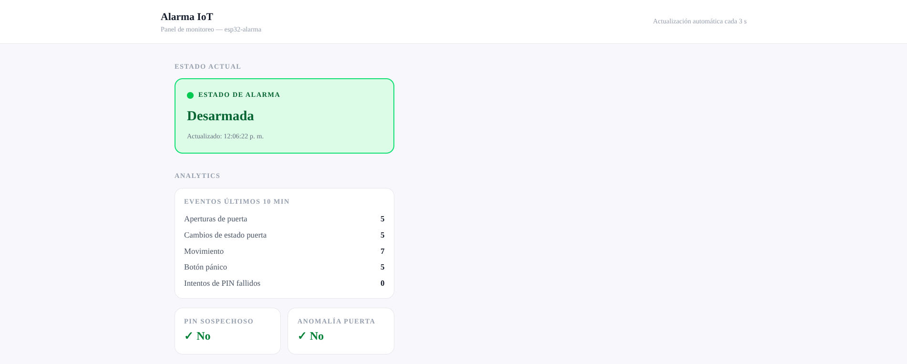
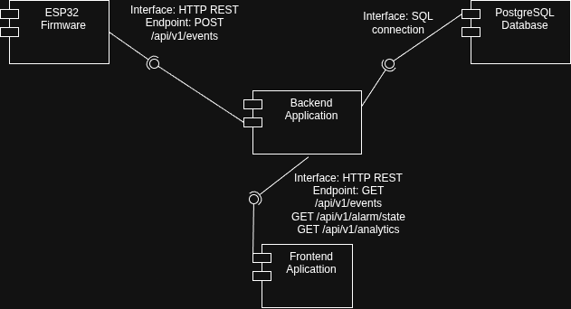

# Home Alarm IoT System

End-to-end IoT home alarm: ESP32 sensors → Flask backend → PostgreSQL → real-time Next.js dashboard.

**Live demo:** [alarma-domiciliaria.vercel.app](https://alarma-domiciliaria.vercel.app)

Built as final project for Software Engineering at Universidad Nacional de Córdoba (2026).

## Architecture

```
ESP32 (C++) → REST → Flask (Python) → SQLAlchemy → PostgreSQL
                                            ↑
                                     Next.js (polling)
```

| Component | Stack | Path |
|-----------|-------|------|
| Firmware | C++ / PlatformIO | `firmware/esp32/` |
| Backend | Flask, SQLAlchemy, Alembic | `backend/flask/final_project/` |
| Frontend | Next.js 16, React 19, Tailwind, shadcn/ui | `frontend/dashboard/` |
| Database | PostgreSQL 16 | `docker/docker-compose.yml` |

## Screenshots

### Dashboard



### System Architecture



## Quick Start

```bash
# 1. Clone and configure
git clone https://github.com/Mariano145/Alarma-domiciliaria.git
cd Alarma-domiciliaria
cp .env.example .env

# 2. Start database
cd docker && docker compose up -d && cd ..

# 3. Start backend
cd backend/flask/final_project
pip install -r requirements.txt
python main.py

# 4. Start frontend (new terminal)
cd frontend/dashboard
pnpm install && pnpm dev
```

| Service | URL |
|---------|-----|
| Backend API | http://localhost:5000 |
| Swagger UI | http://localhost:5000/apidocs/ |
| Frontend | http://localhost:3000 |
| PostgreSQL | localhost:5433 |

## Emulate ESP32 Events

No hardware needed. Send simulated sensor events to test the system:

```bash
pip install requests
python scripts/emulate_esp32.py
```

## Design Patterns

| Pattern | Purpose | Location |
|---------|---------|----------|
| **State** | Alarm state machine (4 states, 7 events) | `alarm_state_manager.py` |
| **Strategy** | 3 interchangeable analytics algorithms | `analytics_service.py` |
| **Observer #1** | Notify on alarm state changes | `alarm_state_observer.py` |
| **Observer #2** | Notify on new event ingestion | `event_observer.py` |

## API Endpoints

| Method | Endpoint | Description |
|--------|----------|-------------|
| POST | `/api/v1/events` | Ingest event from ESP32 |
| GET | `/api/v1/events` | Query historical events |
| GET | `/api/v1/alarm/state` | Current alarm state |
| GET | `/api/v1/analytics` | Derived metrics (10-min window) |

Full contract: [`docs/OpenAPI/openapi.yaml`](docs/OpenAPI/openapi.yaml)

## Testing

```bash
# Backend
cd backend/flask/final_project && pytest

# Frontend
cd frontend/dashboard && pnpm test:run

# Firmware
cd firmware/esp32 && pio test -e native_test
```

## Project Documentation

| Document | Description |
|----------|-------------|
| [Architecture](docs/architecture.md) | System design, layer structure, decisions |
| [Design Patterns](docs/design-patterns.md) | GoF patterns with code references |
| [Requirements](docs/requirements.md) | Functional and non-functional requirements |
| [Git Workflow](docs/workflow-git.md) | Branching strategy (Gitflow) |
| [Commit Convention](docs/commits-convention.md) | Conventional Commits with Jira keys |
| [API Contract](docs/OpenAPI/openapi.yaml) | OpenAPI 3.0 specification |
| [Project Brief](docs/CONSIGNA.md) | University evaluation criteria |

## Author

**Mariano Stroppa**

- GitHub: [@Mariano145](https://github.com/Mariano145)
- LinkedIn: [marianostroppa](https://www.linkedin.com/in/marianostroppa)
- Email: marianostroppa1@gmail.com

This project demonstrates full-stack development, IoT integration, and production deployment.

## License

[GPL-2.0](LICENSE)
